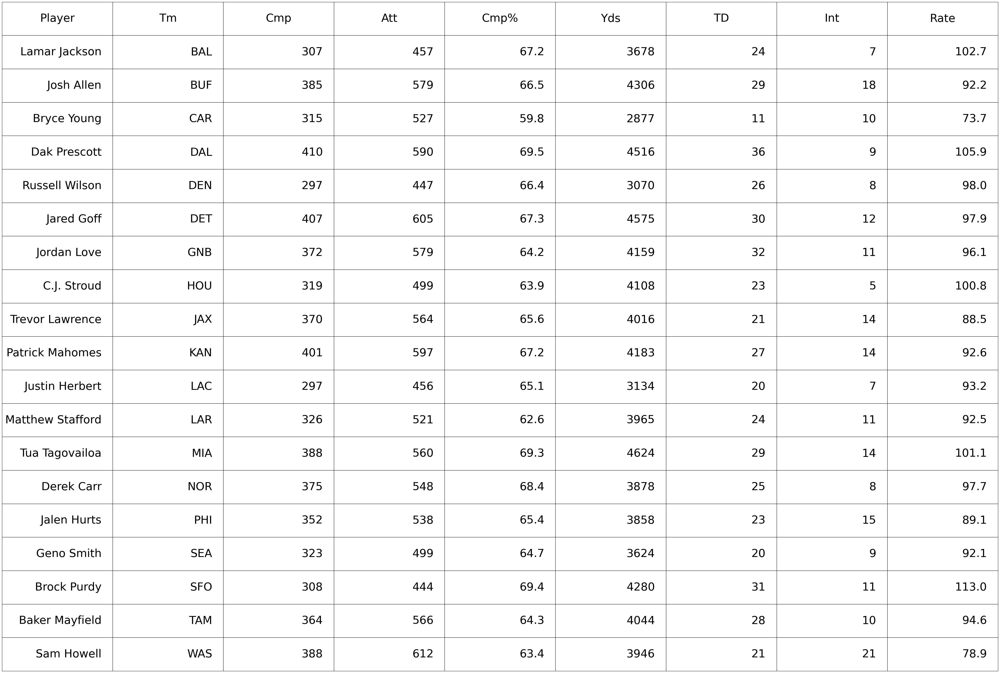
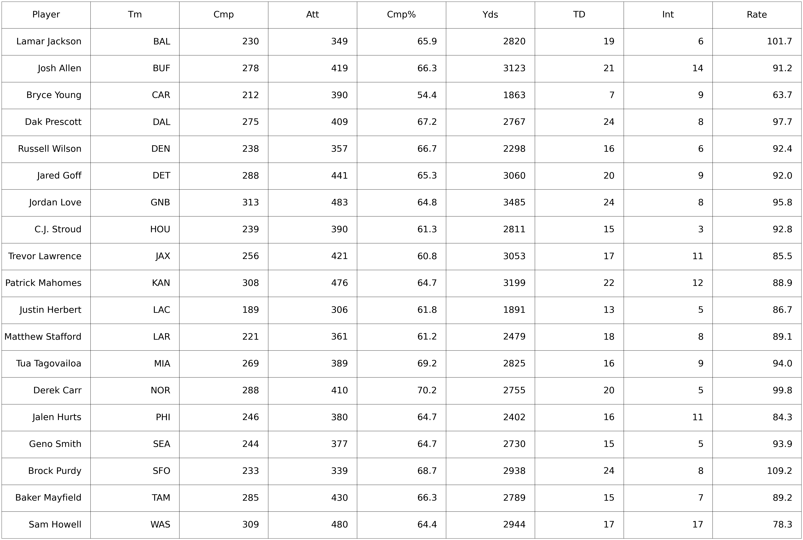
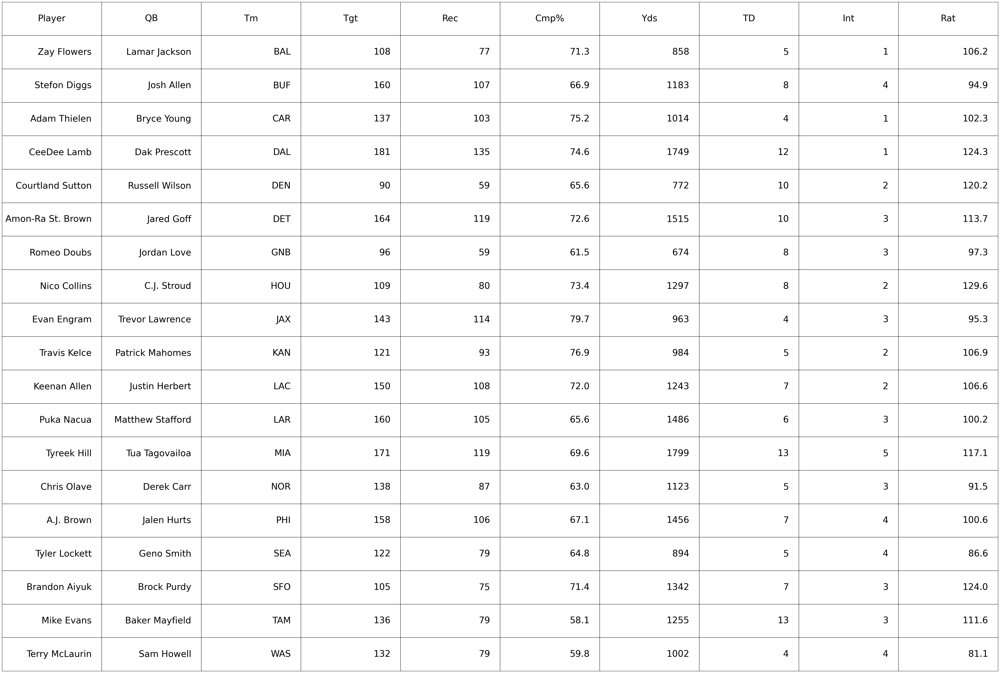
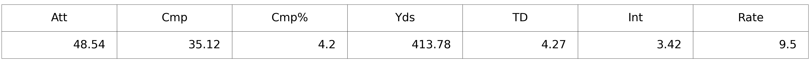
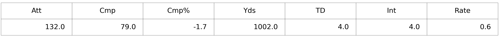
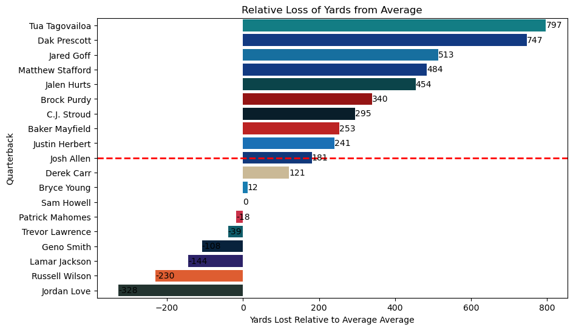
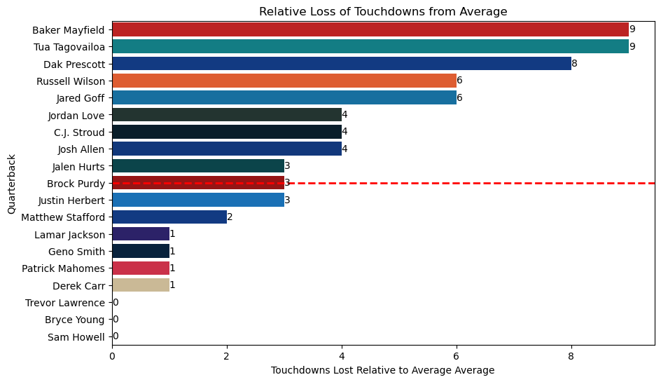
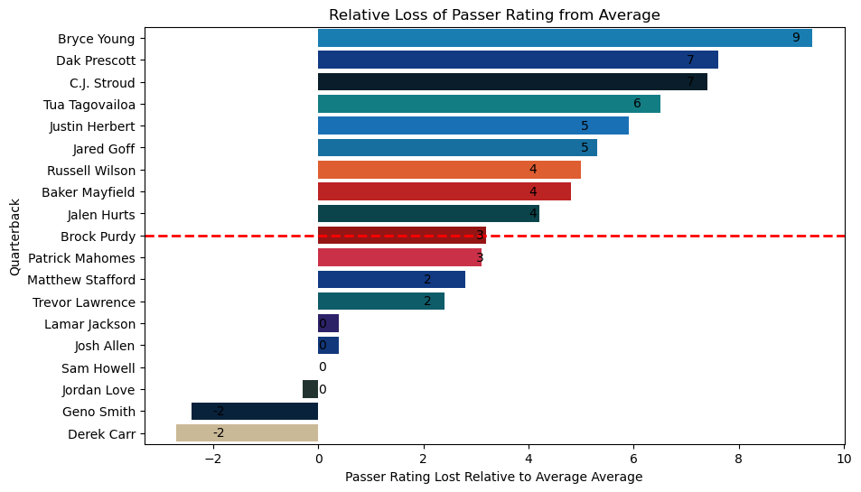

# Introduction

In football, being a ***"merchant"*** means to be so reliant on a particular asset that despite not being genuinely good at his position, a player appears to be good due to external factors rather than his own merits. Rather than contributing to his team, a "merchant" is the beneficiary of having teammates that are far more talented than him.

For instance, after Miles Sander's 2022 season in Philadelphia many considered him to be a good running back since he had over 1200 yards, 4.9 yards per carry, and 11 rushing touchdowns. In reality he was a mediocre running back who achieved statistical success thanks to the prowess of the Eagles’ offensive line. In 2023, when he played with Panthers’ meager offensive line, his numbers plummeted to an inefficacious 432 yards, 3.3 yards per carry, and 1 rushing touchdown. As a result, my friends call Miles Sanders an “Eagles o-line merchant”. 

There are many similar debates on whether a particular quarterback is genuinely talented or is simply an "elite receiver merchant". Answering this question is crucial given the surging rates of quarterback contracts. Does a particular quarterback inflate his passing stats by targeting a potent teammate, or is that quarterback overly scrutinized and can still perform well without his primary weapon? 

In this article, we will analyze a quarterback’s stats in relation to the stats from his top receiver. We will be focusing on the 2023 season in particular because of the exorbitant quarterback contracts that were recently signed. When evaluating a quarterback’s contract, should a GM rely more on their opinion or what the stats state? Why is a particular quarterback's numbers worse than others' after you discount his stats with the stats from his best weapon?

This analysis hopes to provide quantifiable and objective insight to consider when evaluating a quarterback. However, there are countless factors when discussing a quarterback's merits, and stats cannot be examined in a vacuum. While this article hopes to eliminate as much context as possible it is important to keep in mind that this article is not meant to definitively answer these questions.

# Methodology

The website [Pro football reference](https://www.pro-football-reference.com/) conveniently contains the data of every QB and WR’s stats. I derived all my data from the website and took the stats from ***qualifying*** passers from 2023. In order to qualify, a passer must have at least 300 pass attempts throughout the season and play at least 14 games. This is to account for quarterbacks who are unlikely to be top contributors for their top receiver. For instance, Joe Burrow missed nearly half of the season, so it’s unlikely he contributed for all of Ja’Marr Chase’s 1200 yards this season. However, Josh Allen played all 17 games this season, so he qualifies because he accounts for virtually all of Diggs’s yardage this season. I made an exception with Justin Herbert, who started 13 games, because the Chargers' top receiver, Keenan Allen, only played in the 13 games that Herbert also played. Furthermore, I used this database to get acquire each team's ***top receiver***, i.e. the player who led the team in targets.

# Quarterback's Stats
The following are tables of stats from this season before and after I removed a QB’s stats from his top weapon. The top table is the QB’s original stats, while the bottom table is the difference.

I also created a table with stats for the top receivers (i.e. receiver leading the team in receptions), specifically when targeted by the quarterback. For example, 'Int' indicates interceptions thrown when targeting that receiver.

As you can see, not all quarterbacks are equally affected once you remove his stats he got from his best teammate. For example, Jalen Hurts loses over 1400 yards without AJ Brown while Lamar Jackson doesn’t even lose 900 without Zay Flowers. Below is a table of how much a QB loses on average per stat category.

## Quarterback's Stats Loss on Average

I created two tables showing the average reduction of stat total from a passer's stats. We can consider ***targets*** as ***attempts*** and ***receptions*** as ***completions***. The bottom table shows the standard deviation of loss between the quarterbacks.

So this means that a quarterback, on average, loses about 1000 yards of his yardage total, as well as 4 touchdowns. It does make sense that a quarterback’s top receiver would have a 1000 yard season. 
The question is if a receiver’s contributions are proportional to his quarterback’s contributions. Do these stats suggest a quarterback is performing above average and is significantly helping out his receiver’s stats, or is it the other way around and a good receiver is making a quarterback’s stats appear better than what his performance should reflect? 

\newpage

# Charting Differences
To see if a quarterback is a “receiver merchant”, we’d have to see how badly a quarterback’s stats would be diminished after he loses his top performer compared to other quarterbacks who also lose their top receiver. If one quarterback’s stats are more heavily impacted than other passers, then that may insinuate the quarterback's stats are inflated by their supporting cast. I visualized this concept using the barcharts below. Each barchart also has a red dotted line along the median of each quarterback.

## Yards Lost
The first chart I made is of the quarterback’s loss of yards compared to the average quarterback’s loss. Specifically, I’m seeing the distance from the average loss of yards after you subtract a quarterback’s yardage total with his top receiver’s total. Keep in mind that positive is bad in this case, as this means he’s losing more yards than other quarterbacks. Similarly, this means negative is good, as it indicates he’s hurt less than the average quarterback would be.

Again, it is self-evident that some quarterbacks are disparaged more after you remove his top weapon. For instance, without AJ BRown, Jalen Hurts himself loses 454 more yards than the average quarterback without their corresponding top target. Conversely, MVP Lamar Jackson has a *negative* 144 yard difference, meaning that even though the average quarterback would lose 1002 yards from their yardage total, Lamar Jackson would only lose 858 yards. Does this suggest Jackson is better at distributing the ball to his other weapons and is less reliant on a high-end supporting cast? Yardage is just one volume stat reflecting a quarterback’s stat. Let's examine a quarterback's discounted touchdown total.

## TDs Lost

Once again, some quarterbacks need their top receiver to have substantial statistical success, while others are good at distributing touchdowns to other receivers. Once again, positive is bad while negative is good. While Russell Wilson was last in negative impact of yardage subtraction, he is tied for having the third most touchdowns lost without his top target in Sutton. Tua and Dak once again the top 3 quarterbacks in terms of how intrinsically tied their statistical success is to their receiver’s stats. 

## Passer Rating Loss
Volume stats are significant when evaluating a player, but they don’t account for efficiency. Tua lost many yards relative to the average quarterback, but he also threw the most yards in the league this year. Passer rating accounts for efficiency: if you have 4000 yards, that’s not a significant achievement if you threw the ball 700 times and your passer rating would reflect that. Similarly, if you have 4000 yards but threw the ball just 500 times, that’s remarkable throwing efficiency and this would reward your passer rating. Passer rating also accounts for things like TD to INT ratio, completion percentage, etc. So, here’s the passer rating loss graph.

On a per throw basis, Tua’s passer rating would drop significantly without Tyreek, but it wouldn’t drop as badly as some other quarterbacks such as Dak (who was second behind Tua in the volume stat graphs). Quarterbacks like Stroud and Herbert, who supposedly perform well without having receivers as good as Tyreek or CeeDee Lamb, would be about as negatively affected as Tua without their respective leading receivers. 

## Analysis
Throughout these graphs, MVP Lamar Jackson is barely affected at all, indicative of how effective of a passer he is regardless of how talented his receiving corp is. The graphs also suggest Mahomes is barely impacted more than average without his best weapon, which is unsurprising given how he earned his third Super Bowl MVP this year despite his notoriously bad receivers. 

Once again, context matters for stats. Some quarterbacks may have severe statistical drop-offs not necessarily because their set of weapons are elite, but because their set of weapons are so barren that they'd be impaired even further when you take away what little help they do have. In this particular case, the graph implies Bryce Young’s passer rating is severely governed by 33 year old Adam Thielen. Does this mean that Thielen is such a potent receiver that he is the primary basis for Young’s positive plays, or does this mean that the Panthers’ offense is so dismal that their only somewhat reliable weapon for their rookie quarterback just happens to be their “least bad” receiver? Considering the fact that the Panthers got shut out in two consecutive weeks, I have a feeling it’s more of the latter.

\newpage

# Conclusion

Calling a QB an “elite receiver merchant” is a conclusion made by the "eye test", “feel”, or other vague and subjective observations. These graphs attempted to objectively quantify how accurate these opinions are. With that being said, these stats are also inherently subjective. Rather than provide a definitive answer to the question "is X QB a merchant of Y receiver?", these findings are meant to provide insight and help you evaluate a particular quarterback in relation to numbers from other quarterbacks and their receivers.

For instance, one who believes Tua is a Tyreek merchant can use these graphs to validate their opinion. Conversely, those who criticize Tua while simultaneously laud CJ Stroud for elevating his receivers should consider the passer rating stats that insinuate Stroud is almost as reliant on Nico Collins as Tua is on Tyreek Hill. Of course, the passer rating graph alone shouldn't be the sole factor that dictates your opinions on these quarterbacks, rather the graph is meant to be some food for thought.

There are ways to perform more rigorous data analysis in order to get a more conclusive answer from these stats. One could perform further investigations, use more qualifying QBs, use more efficiency metrics, and use more precise calculations that can account for efficiency lost rather than sheer volume. For instance, the TD graph show the raw volume of passing TDs lost per quarterback and doesn't account for the fact that Dak would lose more TDs than other passers because he had the most passing touchdowns in the 2023 season. Moreover, one could use data from multiple seasons to expand the sample size, use data from a team's top 3 target rather than their single top target (is Brock Purdy good or a product of having *several* great weapons?), account for other factors such as the run game, etc.

These are meant to provide objective evidence to support an opinion, not to validate confirmation biases. Instead of espousing opinion-based narratives from talking heads, use stats, in amalgamation with non-statistical evidence, to give you a stronger understanding of football.
